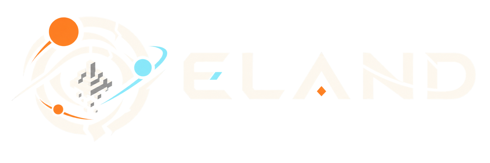
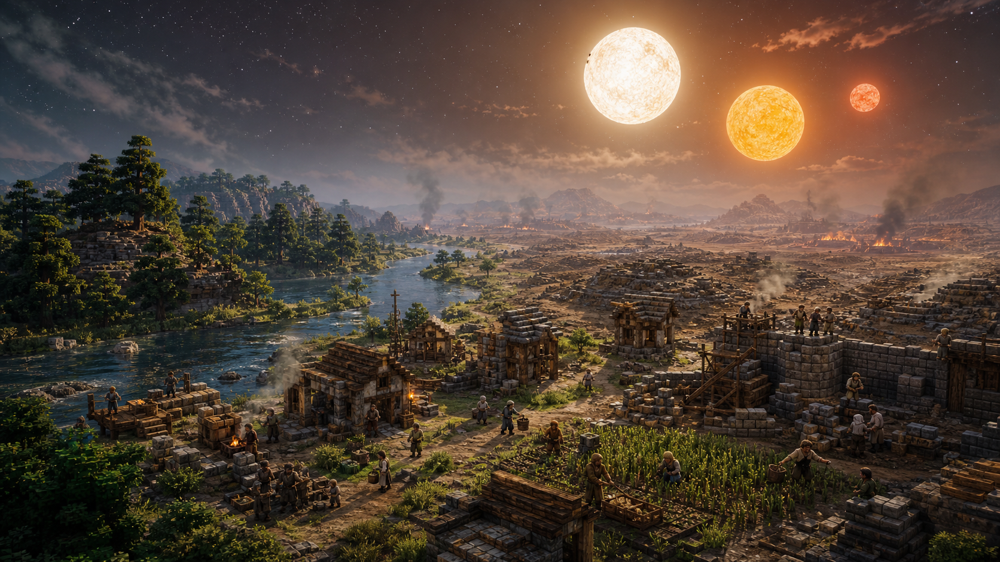

# ELAND

  

> “第 183 号文明毁灭于三日凌空。该文明曾进化至中世纪。漫长岁月之后，生命与文明将再次启动……”

ELAND 是一款开源的规则优先涌现式文明模拟游戏，也是一只会自行生长的赛博鱼缸。它的灵感来自《三体》中的三体游戏，以及 AIvilization 等智能体实验。

## 从一无所有开始

在这片三维沙盒世界里，森林覆盖大地，河流穿过无人的荒野。一群以人类历史人物为代号的先民 Agent 在此醒来。他们没有工具，没有房屋，也没有现成的文明答案，一切都要从亲手认识这个世界开始。

他们寻找食物、采集材料、制造工具、修筑居所；也会相爱、争吵、结成家庭，把经验传给后来者。技术不是菜单里的一棵树，而是从观察、试错、学习和传承中慢慢生长出来的。

文明的道路从不平静。饥饿、野兽与同伴间的冲突随时可能终结生命，而无情的三星系统还会带来无法预测的恒纪元与乱纪元。一次漫长严寒，一场失控野火，或某个三日凌空的清晨，都可能让数百年的积累顷刻归零。

## 他们称你为“主”

玩家是他们口中的“主”。

你可以与 Agent 交谈，向他们示警、提出建议，甚至故意误导他们。你的话可能进入他们的记忆，影响此后的判断，但他们未必服从。你也可以化身其中，以第一人称走进聚落，亲历一个 Agent 的劳作、关系与生存。

## 没有写好的历史

这里没有预先写好的文明剧本。每个 Agent 只能依据自己感知到的环境、个人记忆、现实需要、社会关系与已有知识作出选择。大模型参与对话、表达和协商；行动能否发生、又会造成什么后果，仍由同一套世界规则裁定。

有些文明会制造农具、建立聚落，走向制度与传承；另一些文明还未熬过第一个乱纪元，便只剩下一行纪年。

每个文明的编号、成就与毁灭原因，都来自真正发生过的模拟历史。

世界终会重启。

下一次，又会长出另一段历史。
