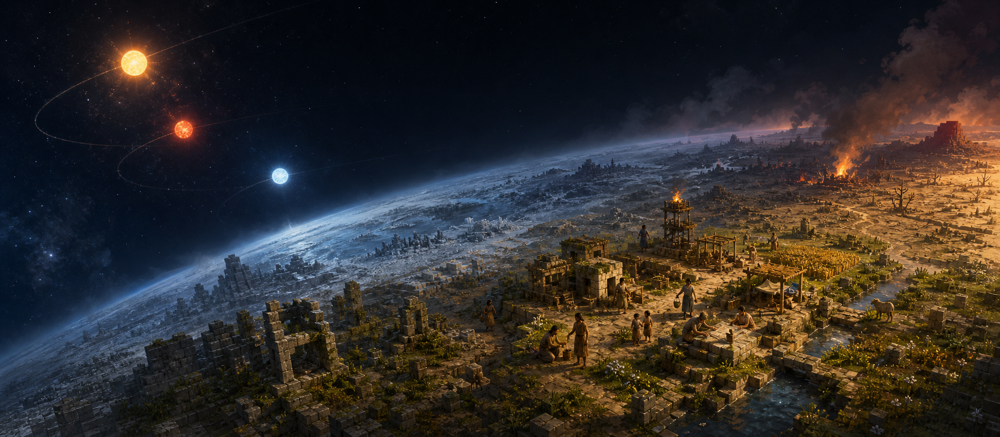

# ELAND

> 三颗太阳支配着一颗行星。文明只在它们允许的时间里生长。

行星上没有可靠的历法，只有恒纪元和乱纪元。

恒纪元到来时，河流解冻，植物重新生长，人们从藏身处醒来。他们取水，寻找食物，把散落的材料搬到一起。最初，这些行动只是为了活过当天。后来，有人留下火种，有人记住了植物成熟的时间，有人开始修筑可以容纳更多人的住所。

这些事情发生以后，文明才算拥有了它们。

## 他们不知道自己将成为什么

每个文明都从一小群人开始。他们有身体、性格和零散的经验，却没有一张写明未来的图纸。

火不会因为时代需要它而出现。一个人必须先找到材料，尝试某种做法，并承担失败的后果。房屋不会在文明进入某个阶段后自动完成。木石要被发现、搬运和放置，未完成的墙也可能在灾难到来时失去意义。

知识存在于具体的人身上。发现者死去而没有把经验告诉别人，这项发现也会随之消失。一个办法被反复验证，被他人记住，传给尚未出生的人，才可能成为传统。

历史不会补写没有发生的部分。

## 每个人只知道附近的事

行星上没有人能看见完整地图。他们只知道去过的地方、见过的东西，以及别人曾经告诉他们的话。

饥饿会中断正在进行的工作。受伤的人可能无法履行承诺。一次照护会留下信任，一次背弃也会留下后果。孩子需要成年人停下手里的计划，老人可能在住所完工前死去。共同体就在这些具体的选择中形成，也可能因此分裂。

他们不知道什么是文明指数，也不会为了抵达某个时代而行动。后世称为技术、制度和道路的东西，在当时只是某个人对眼前问题的一次处理。

## 乱纪元没有恶意

三颗太阳的运行不会考虑地表正在发生什么。

乱纪元可能带来漫长的严寒，也可能使河床干裂，让火越过刚刚建成的聚落。观星者可以从过去的天象中寻找规律，但预言必须经受下一次灾变的检验。即使判断正确，也要有人相信，并在时间耗尽前储水、迁徙或进入脱水休眠。

成年人也许能够独自活下来。孩子、伤者和老人不能。一个文明是否会越过乱纪元，有时取决于它学会了多少；有时只取决于灾难到来时，有没有人回头。

恒纪元仍会再次出现。它不保证届时还有人醒来。

## 史册只记录已经发生的事

文明可以学会耕种、烹饪和记录，也可能长期停留在取水与觅食之间。有的延续数代，有的没能活过第一次天象突变。这里没有预定的发明，没有必须抵达的时代，也没有为了某句结语而安排好的死亡。

当最后一个人倒下，史册会回看这段文明的真实历史：他们在哪里定居，掌握过什么，怎样对待彼此，最后又被什么带走。文明编号和毁灭原因都在这时确定。

> 第 141 号文明，毁灭于烈焰。

这句话很短。它前面是许多年。

此后，第 142 号文明在河边醒来。他们看见水、石头、陌生的同伴，以及天上三颗正在改变位置的太阳。他们不知道上一群人走过哪条路。世界也不会要求他们重复一次旧历史。

## 你从远处看着

从宇宙中望去，文明只是行星表面短暂的亮点。继续靠近，亮点里会出现道路、住所和正在活动的人。再靠近一些，你会知道他们的名字，看见一个人去取水，另一个人照顾孩子，还有人站在没有完成的墙边，计算天黑前剩下的时间。

你可以听他们说话，也可以向某个人提出建议。他可能接受，可能迟疑，也可能拒绝。即使被接受，一句话也不能变出不存在的材料、知识和能力；它只能进入这个人当下能够理解、也确实能够执行的选择。

你知道天空中有三颗太阳，却同样不知道这个文明的结局。
